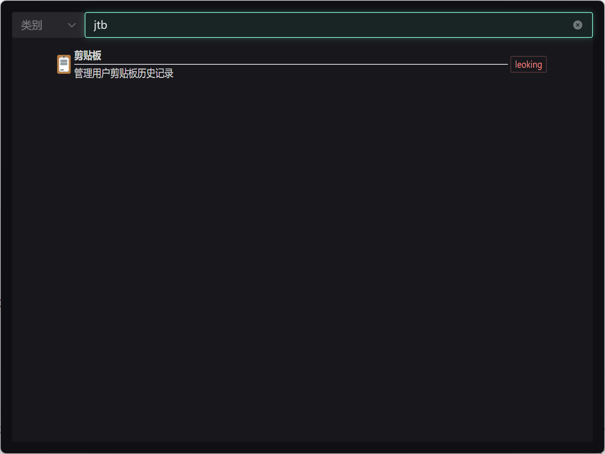
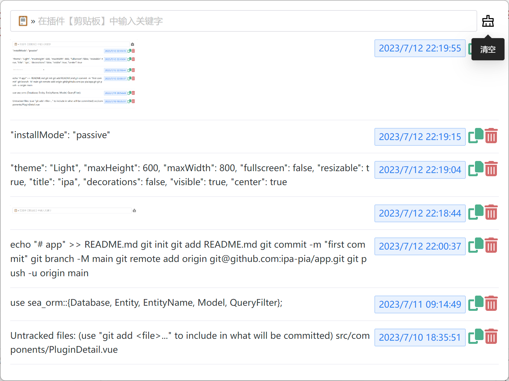
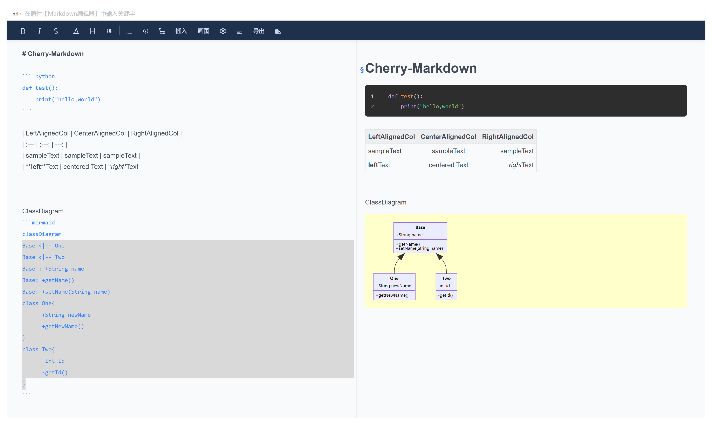
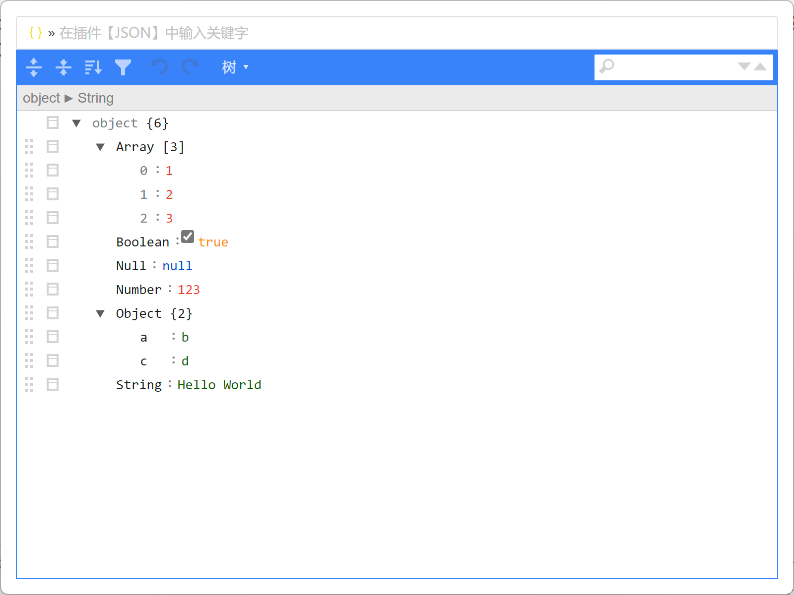

# 智能个人助手

基于tauri开发的一款桌面app，插件式机制，允许用户自定义插件

支持平台：

- [x] windows
- [ ] linux
- [ ] macos

功能特性：

1. 自定义插件、插件商店
2. 明亮、暗黑主题
3. 内置：剪贴板、TODO、翻译、Markdown、JSON等功能
4. 更多功能积极开发中。。。

## 快捷键
参见[快捷键说明](./shortcuts/)

## 如何自定义插件

使用官方提供的模版可快速完成插件的开发，具体使用方式参见[ipa-plugin-tmpl](https://github.com/xdewx/ipa-plugin-tmpl.git)
